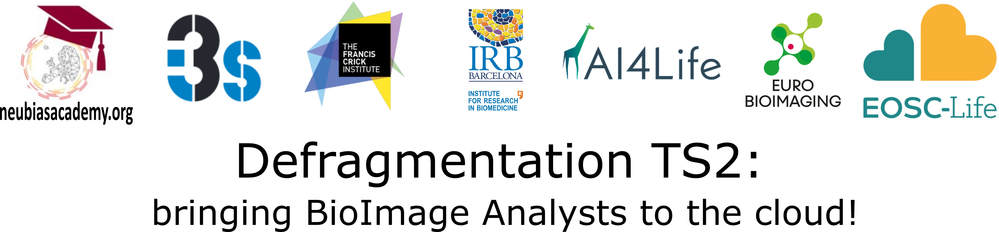

# Defragmentation Training School 2 - NEUBIAS Academy & EOSC-Life 2023

A training school for the new generation of bioimage analysts. Topics: workflow-based image analysis and new integrated methods for cloud computing applied to life sciences.

### "Defragmentation TS2: bringing BioImage Analysts to the cloud!”

#### Programme:

|Date | Day | Sessions| Speakers | Time|
|-----|-----|---------|---------|---------|
|8 May | Day 1 | <b>Welcome. Overview and logistics</b>   
<b>Student introductions</b>
 
 
<b>Introduction: What is bioimage analysis?</b>
  
<b>Jupyter for interactive cloud computing</b>
  
<b>Cloud-hosted image data storage, visualisation and sharing</b>
  
<b>Work on your own data</b>
   
<b>OMERO</b>
|   
Paula Sampaio & Rocco D'Antuono
    
Kota Miura
  
Guillaume Witz
  
Bugra Oezdemir
  
Rocco D'Antuono & other Trainers
    
 Petr Walczysko 
    |
 09:00 
   
 09:30   
 
 11:30 
    
 14:00  
  
15:30
  
 16:00 
|
|9 May | Day 2 | 
<b>Parallelization and heterogeneous computing: from pure CPU to GPU-accelerated image processing</b>
 
 
<b>Zero code Deep Learning tools for Bioimage Analysis</b>
  
<b>Analysis of Microtubule Orientation</b>
  
<b>CellProfiler for HCS data on the cloud</b>
  
<b>Work on your own data</b>
| 
Marcelo Zoccoler
   
Daniel Sage and Estibaliz Gomez de Mariscal
  
Thomas Pengo
  
Nodar Gogoberidze & Anna Klemm
  
Rocco D'Antuono & other Trainers
|
 09:00 
  
 11:30   
 
 14:00 
  
 15:00  
 
 17:00 
|
|10 May | Day 3 | 
<b>Metrics and Benchmarking</b>
 
 
<b>BIAFLOWS: A BioImage Analysis workflows benchmarking platform</b>
  
<b>Machine and Deep Learning on the Cloud: Classification</b>
  
<b>[Machine and Deep Learning on the Cloud: Segmentation](https://docs.google.com/presentation/d/1NyYyPZ_u9JJ35PQI_ZTjU9wAJnqdvuF4K0MfT_Pmpe8/edit#slide=id.g6ee2a06502_2_69)</b>
  
<b>Work on your own data</b>
| 
Martin Maška
   
Sébastien Tosi, Volker Baecker, and Benjamin Pavie
  
Felix Mercier
  
Ignacio Arganda Carreras
  
Rocco D'Antuono & other Trainers
|
 09:00 
  
 10:00   
 
 12:00 
  
 12:30  
 
 16:30 
|
|11 May | Day 4 | Symposium|
|12 May | Day 5 | Symposium|

 
Defragmentation TS2 is part of the NEUBIAS 5th Conference:
https://eubias.org/NEUBIAS/neubias2020-conference/portugal-2023/
 

 

Scientific Organizers: <b>Paula Sampaio, Rocco D'Antuono, Aastha Mathur, Beatriz Serrano Solano, Ana Stojiljkovic, Maria Azevedo, Kota Miura, Julien Colombelli</b>.
 
 
Event Timing:
8-12 May 2023, Porto, PT
 
 
Defragmentation TS2 Contacts:
<li>Paula Sampaio, i3S, Porto, sampaio@i3s.up.pt
<li>Rocco D'Antuono, The Francis Crick Institute, London, rocco.dantuono@crick.ac.uk  

  Please use the following subject: Defragmentation TS2

---
# Training School preparation #
Trainees are kindly asked to get ready for the TS2 by doing the following homework in advance.
### Day 1  

Get the following accounts for :

- Galaxy account: https://live.usegalaxy.eu/login/start?redirect=None

- Google account for Colab : Google [Sign up](https://accounts.google.com/signup/v2/webcreateaccount?flowName=GlifWebSignIn&flowEntry=SignUp)
(a working Google account, not a linked account that you manage with Google). Make sure the account has enough free space (~ several GB) on it.
- A Github account for Binder: [Sign up](https://github.com/)

- follow the instructions from Dr. Bugra Oezdemir to access BAND and run the script that installs the needed software on the remote desktop.
  - Instructions: https://tinyurl.com/3rcwhs4d
  - Repository for the tools: https://github.com/Euro-BioImaging/OME_Zarr_Tools
  - Training page: https://neubias.github.io/training-resources/ome_zarr/index.html

 

### Day 2  

#### GPU-Accelerated Image Processing and Machine Learning

- Download and install mambaforge following the instructions in this blog post: https://biapol.github.io/blog/mara_lampert/getting_started_with_mambaforge_and_python/readme.html
Follow the instructions there up to the 'Starting napari' sub-title.

- Link to slides: https://f1000research.com/slides/12-473

- Link to Github repository with exercises/demonstrations: https://github.com/zoccoler/GPU_Accelerated_Image_Processing_on_Cloud_NEUBIAS_Defragmentation_TS2_2023

#### Zero-Code Deep Learning tools for BioImage Analysis
**Fiji installation:**
  - Download and install it from [here](https://imagej.net/software/fiji/downloads)
  - Install the plugins deepImageJ and MorphoLibJ using the Updater of Fiji:
      - Help > Update… > Open the “Manage update sites”.
      - Select DeepImageJ, IJPB-Plugins (i.e., MorpholibJ)
  - Close Fiji and open it again. You're ready!

**Transfer the data to your Google Drive**
  - [Link to the data](https://go.epfl.ch/neubias). Download the `ctc-glioblastoma` folder.

**Open the ZeroCostDL4Mic notebook for the 2D U-Net multilabel**
  - Link to the notebook in the [BioImage Model Zoo](https://bioimage.io/#/?type=application&tags=unet&id=zero%2Fnotebook_u-net_2d_multilabel_zerocostdl4mic).
  - You can also find all the notebooks in [ZeroCostDL4Mic Wiki Page](https://github.com/HenriquesLab/ZeroCostDL4Mic/wiki#segmentation-networks).

*Resources:*
- DeepImageJ Gómez-de-Mariscal, E., et al., Nat Meth 2021, [doi:10.1038/s41592-021-01262-9](https://doi.org/10.1038/s41592-021-01262-9)
- MorpholibJ Legland, D., Arganda-Carreras, I., & Andrey, P., Bioinformatics, 2016, [doi:10.1093/bioinformatics/btw413](https://doi.org/10.1093/bioinformatics/btw413)
- ZeroCostDL4Mic: von Chamier, L. et al., Nat Comm 2022, [doi:10.1038/s41467-021-22518-0](https://doi.org/10.1038/s41467-021-22518-0)
- BioImage Model Zoo Ouyang, W., et al., bioRxiv 2022, [doi:10.1101/2022.06.07.495102](https://doi.org/10.1101/2022.06.07.495102)

#### Instructions for CellProfiler presentation:

If you don't have it yet, install CellProfiler, either:

* built package: https://cellprofiler.org/releases
* python package (in a conda or virtual environment): pip install "cellprofiler==4.2.5"
* from source (also in a new environment): https://github.com/CellProfiler/CellProfiler/wiki
  * this option is more involved, including installing java
Download "Beginner Segmentation" materials from here: https://tutorials.cellprofiler.org/

[Optional] install docker from here: https://www.docker.com/, and dockerfile from here: https://github.com/CellProfiler/distribution/tree/master/docker

### Day 3:  

You need a Docker Hub account with the same name as your GitHub account. Docker Hub allows only letters and digits. ‘-’ on GitHub will be removed for Docker Hub
Everything will be made lower-case for Docker Hub, like follows:

volker-baecker   ->   volkerbaecker

Create you accounts:

- GitHub account: https://github.com/

- Docker Hub account: https://hub.docker.com/

BIAFLOWS sandbox server: https://biaflows-sandbox.neubias.org

---

# Training School material #
(uploaded at the end of the school)
### Day 1:

### Day 2:

### Day 3:

### Day 4:
- AI4Life Session
  - [Deep learning-based bioimage analysis workflows for all audiences: BiaPy](https://docs.google.com/presentation/d/1qHizZnaJAiy0fWcmUUIMNzX3k7ImCyrhtG6WfTasABs/edit#slide=id.g6ee2a06502_2_69)
  - [Deep learning enabled cellular imaging: making it happen for you](https://drive.google.com/file/d/1qIMtP09006zWMhBnenwSH_jrsFVsSJcx/view)
  - [Segment Anything for Microscopy](/slides/Segment%20Anything%20for%20Microscopy.pdf)
  - [Deep learning with sparse annotations in cell image segmentation](/slides/Deep%20learning%20with%20sparse%20annotations%20in%20cell%20image%20segmentation.pdf)
  - [Data Analysis for Super-Resolution Microscopy in nanomedicine](/slides/Data%20Analysis%20for%20Super-Resolution%20Microscopy%20in%20nanomedicine.pdf)
  - Arkitekt - Streaming analysis and real-time workflows for microscopy 

### Day 5:
